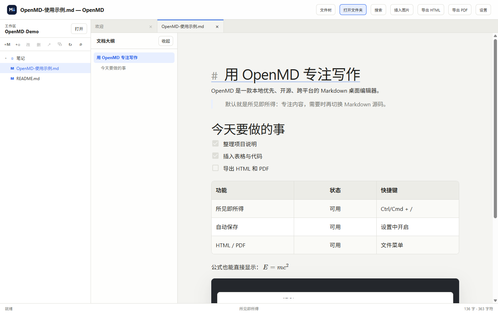
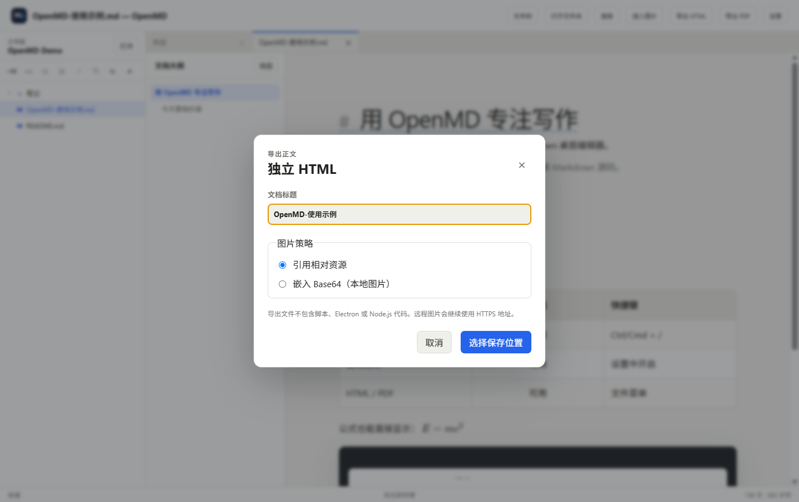

# OpenMD 用户使用手册

这份手册面向第一次使用 OpenMD 的用户。只想马上开始写作，可以先看“第一次使用”；遇到图片、公式、导出或自动保存问题时再查看对应章节。

[返回项目首页](../README.md) · [下载最新版](https://github.com/ZHUI33/OpenMD/releases/latest) · [反馈问题](https://github.com/ZHUI33/OpenMD/issues)

## 第一次使用

1. 打开 OpenMD。
2. 按 `Ctrl/Cmd + N` 新建文档。
3. 在正文区域直接输入标题、段落和列表。
4. 按 `Ctrl/Cmd + S`，选择保存目录和以 `.md` 结尾的文件名。
5. 以后可以从“最近打开”、系统文件管理器或“打开”按钮继续编辑。

OpenMD 默认使用所见即所得模式。Markdown 标记会转换为标题、列表、表格等正文效果，不需要同时打开另一个预览窗口。



## 认识界面

- **顶部操作区**：打开文件夹、搜索、插入图片、导出和设置。
- **左侧文件树**：显示当前工作区的文件和文件夹，可新建、重命名、删除和刷新。
- **文档大纲**：根据标题快速跳转，较长文档尤其有用。
- **标签栏**：同时编辑多个文档；圆点表示该文档还有未保存修改。
- **正文编辑区**：默认所见即所得，也可以切换为 Markdown 源码。
- **底部状态栏**：显示保存状态、编辑模式、字数和字符数。

## 新建、打开与保存

### 新建文档

选择“文件 → 新建”或按 `Ctrl/Cmd + N`。新文档第一次按保存时，OpenMD 会询问文件位置；未选择位置前不会自动保存到未知目录。

### 打开单个文件

选择“文件 → 打开”、按 `Ctrl/Cmd + O`，或者在安装后直接双击 `.md` / `.markdown` 文件。

### 打开文件夹工作区

点击右上角“打开文件夹”或按 `Ctrl/Cmd + Shift + O`。适合管理项目文档、知识库或一组笔记，并可以使用：

- 左侧文件树。
- 多文档标签页。
- 文档大纲。
- `Ctrl/Cmd + Shift + F` 全文搜索。

### 保存和另存为

- 保存：`Ctrl/Cmd + S`
- 另存为：`Ctrl/Cmd + Shift + S`

关闭有未保存修改的标签页或退出应用时，OpenMD 会要求确认，不会静默丢弃修改。

## 所见即所得与源码模式

按 `Ctrl/Cmd + /` 随时切换。两个模式编辑的是同一份 Markdown 内容：

- **所见即所得**适合日常写作、阅读和整理结构。
- **源码模式**适合精确调整 Markdown、粘贴复杂表格或排查语法。

可以在“设置 → 默认编辑模式”中修改新打开文档使用的模式。OpenMD 不使用左右分栏预览。

## 常用 Markdown

在源码模式中可以直接输入以下内容；切回所见即所得后会立即渲染。

````markdown
# 一级标题

## 二级标题

**粗体**、_斜体_、[链接](https://example.com)

- 普通列表
- [x] 已完成任务
- [ ] 未完成任务

> 引用内容

| 名称   | 状态 |
| ------ | ---- |
| OpenMD | 可用 |

```ts
const editor = 'OpenMD'
```
````

## 插入图片

在所见即所得模式中点击“插入图片”，选择本地图片。源码模式下也可以使用：

```markdown

```

“设置 → 图片资源目录规则”决定复制进来的图片放在哪里：

- `文档名.assets`
- `文档目录/assets`
- `工作区/assets`
- 自定义相对目录

如果“插入图片”按钮不可用，请先切换回所见即所得模式。

## 公式

行内公式：

```markdown
质能方程是 $E = mc^2$。
```

块级公式：

```markdown
$$
\int_0^1 x^2\,dx = \frac{1}{3}
$$
```

公式使用 KaTeX 渲染。语法不完整时会保留可编辑内容，修正后重新渲染。

## Mermaid 图表

使用 `mermaid` 围栏代码块：

````markdown

````

OpenMD 会显示安全处理后的图表预览。图表语法错误不会导致整个编辑器失效，可以回到源码继续修改。

## 自动保存

1. 点击右上角“设置”。
2. 开启“自动保存”。
3. 根据需要调整延迟；默认是 1500ms。
4. 点击“保存”。

自动保存只处理已经有文件路径的文档。新建但从未手动保存过的文档不会被静默写入磁盘。保存失败时文档仍显示为“已修改”，并出现错误提示。

## 导出 HTML

点击“导出 HTML”或按 `Ctrl/Cmd + Alt + H`：

1. 填写导出文档标题。
2. 选择图片策略。
3. 点击“选择保存位置”。



图片策略的区别：

- **引用相对资源**：文件更小，适合 HTML 与图片文件夹一起交付。
- **嵌入 Base64**：把已授权的本地图片放进 HTML，便于只发送一个文件；远程图片仍使用 HTTPS 地址。

导出的 HTML 包含正文、表格、代码高亮、KaTeX 和已经渲染的 Mermaid，不包含 Electron 或 Node.js 代码。

## 导出 PDF

点击“导出 PDF”或按 `Ctrl/Cmd + Alt + P`。可以设置：

- A4 或 Letter。
- 文档标题。
- 页边距。
- 是否打印背景。

PDF 只包含文档正文，不会把文件树、标签栏、标题栏或状态栏打印进去。导出时使用浅色打印主题。

## 外观与编辑设置

右上角“设置”中可以调整：

- 跟随系统、浅色、深色或用户主题。
- 字体、字号、行高与正文最大宽度。
- 默认编辑模式。
- 自动保存与更新检查。
- 源码行号和长行自动换行。
- 图片资源目录。
- 文件树是否显示普通文本文件。

## 快捷键

表格中的 `Ctrl/Cmd` 表示 Windows 使用 `Ctrl`，macOS 使用 `Cmd`。

| 操作                | 快捷键                 |
| ------------------- | ---------------------- |
| 新建                | `Ctrl/Cmd + N`         |
| 打开文件            | `Ctrl/Cmd + O`         |
| 打开文件夹          | `Ctrl/Cmd + Shift + O` |
| 保存                | `Ctrl/Cmd + S`         |
| 另存为              | `Ctrl/Cmd + Shift + S` |
| 切换所见即所得/源码 | `Ctrl/Cmd + /`         |
| 工作区搜索          | `Ctrl/Cmd + Shift + F` |
| 导出 HTML           | `Ctrl/Cmd + Alt + H`   |
| 导出 PDF            | `Ctrl/Cmd + Alt + P`   |

## 文件与隐私

- 文档保存在用户选择的本地路径，格式是普通 Markdown。
- OpenMD 不要求登录，也不会把文档上传到云端。
- Renderer 无法直接调用 Node.js；文件操作通过受限桌面 API 完成。
- 自动更新仅在发布版中使用 GitHub Releases，并可以在设置中关闭。

## 常见问题

### 为什么新文档没有自动保存？

新文档还没有文件路径。先按 `Ctrl/Cmd + S` 完成第一次保存，之后自动保存才会工作。

### 导出的 HTML 在另一台电脑上看不到图片？

重新导出并选择“嵌入 Base64”，或者把 HTML 与其引用的图片目录一起复制。

### 为什么远程图片没有嵌入 HTML？

Base64 模式只读取用户授权的本地图片，不会代替用户下载远程内容。

### 公式或 Mermaid 没有显示？

切换到源码模式检查分隔符、围栏和语法。错误内容会保留，修正后可以再次渲染。

### 安装时系统提示来源未知怎么办？

确认安装包来自本仓库 Releases，并核对 Release 提供的 SHA-256 与签名说明。如果无法确认来源，请不要绕过系统安全提示，可以改为从源码启动或等待签名版本。

### 如何报告问题？

前往 [GitHub Issues](https://github.com/ZHUI33/OpenMD/issues)，提供操作系统、OpenMD 版本、复现步骤和必要截图。请不要附带私人文档或密钥。
