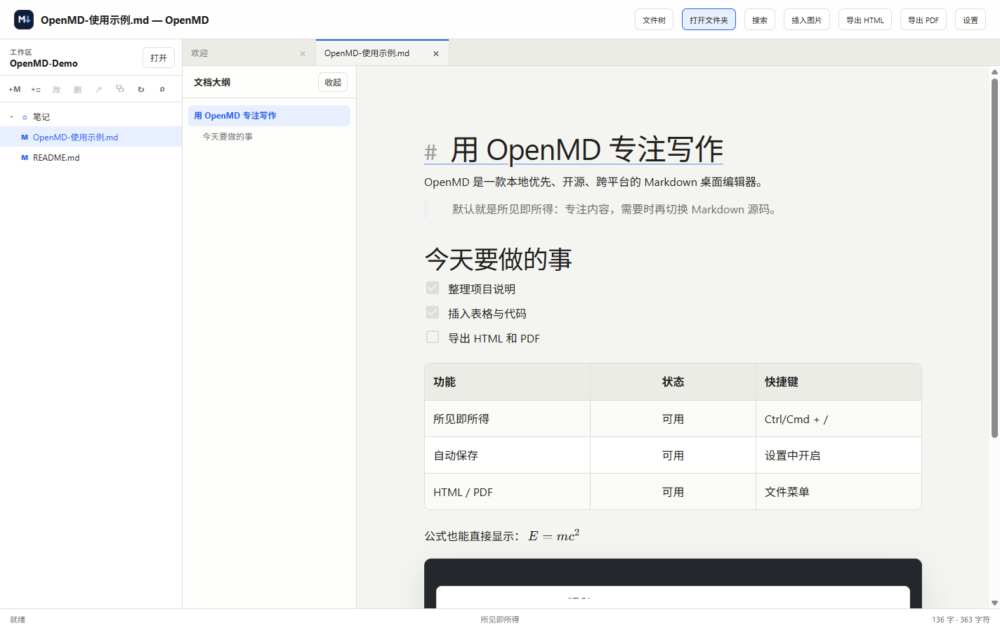
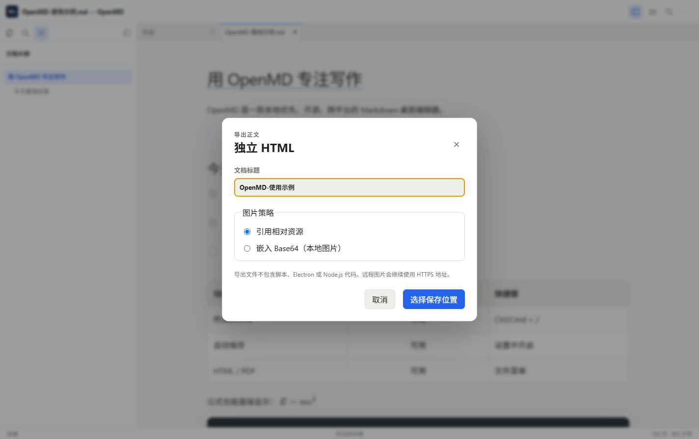

# OpenMD 用户使用手册

这份手册面向第一次使用 OpenMD 的用户。只想马上开始写作，可以先看“第一次使用”；遇到图片、公式、导出或自动保存问题时再查看对应章节。

[返回项目首页](../README.md) · [下载最新版](https://github.com/ZHUI33/OpenMD/releases/latest) · [反馈问题](https://github.com/ZHUI33/OpenMD/issues)

## 第一次使用

1. 打开 OpenMD。
2. 按 `Ctrl/Cmd + N` 新建文档。
3. 在正文区域直接输入标题、段落和列表。
4. 按 `Ctrl/Cmd + S`，选择保存目录和以 `.md` 结尾的文件名。
5. 以后可以从“最近打开”、系统文件管理器或“打开”按钮继续编辑。

OpenMD 默认使用所见即所得模式。Markdown 标记会转换为标题、列表、表格等正文效果，不需要同时打开另一个预览窗口。



## 认识界面

- **顶部操作区**：打开文件夹、搜索、插入图片、导出和设置。
- **左侧文件树**：显示当前工作区的文件和文件夹，可新建、重命名、删除和刷新。
- **文档大纲**：根据标题快速跳转，较长文档尤其有用。
- **标签栏**：同时编辑多个文档；圆点表示该文档还有未保存修改。
- **正文编辑区**：默认所见即所得，也可以切换为 Markdown 源码。
- **底部状态栏**：显示保存状态、编辑模式、字数和字符数。

## 新建、打开与保存

### 新建文档

选择“文件 → 新建”或按 `Ctrl/Cmd + N`。新文档第一次按保存时，OpenMD 会询问文件位置；未选择位置前不会自动保存到未知目录。

### 打开单个文件

选择“文件 → 打开”、按 `Ctrl/Cmd + O`，或者在安装后直接双击 `.md` / `.markdown` 文件。

### 打开文件夹工作区

点击右上角“打开文件夹”或按 `Ctrl/Cmd + Shift + O`。适合管理项目文档、知识库或一组笔记，并可以使用：

- 左侧文件树。
- 多文档标签页。
- 文档大纲。
- `Ctrl/Cmd + Shift + F` 全文搜索。

### 保存和另存为

- 保存：`Ctrl/Cmd + S`
- 另存为：`Ctrl/Cmd + Shift + S`

关闭有未保存修改的标签页或退出应用时，OpenMD 会要求确认，不会静默丢弃修改。

### 草稿与异常退出恢复

OpenMD 会定期把未命名文档和已修改但尚未保存的文档原子备份到 Electron
`userData/recovery` 专用目录。记录只保存在本机，不上传，也不会写入原文档路径。正常保存会清理该
文档对应记录，正常退出会清理会话记录。

崩溃、断电或强制结束进程后，下次启动会显示恢复窗口，其中列出文档名、原路径、备份时间和内容摘要。
可以恢复单个标签，也可以恢复上次工作区、全部打开标签和活动标签。带未保存修改的内容始终以“已恢复”
副本打开；只有随后由用户明确执行保存/另存为，才会写入用户选择的位置。

### 快速打开和标签切换

按 `Ctrl/Cmd + P` 输入文件名，可以模糊搜索当前工作区和最近文件。使用方向键选择，
`Enter` 打开，`Escape` 关闭。已经打开的同一路径只会切换到原标签，不会创建重复标签。

- 关闭当前标签：`Ctrl/Cmd + W`
- 下一个/上一个标签：`Ctrl + Tab` / `Ctrl + Shift + Tab`
- 恢复最近关闭标签：`Ctrl/Cmd + Shift + T`

标签切换会保留每份文档的编辑模式、光标和滚动位置。未保存标签仍会先进入保存/放弃确认。

## 所见即所得与源码模式

按 `Ctrl/Cmd + /` 随时切换。两个模式编辑的是同一份 Markdown 内容：

- **所见即所得**适合日常写作、阅读和整理结构。
- **源码模式**适合精确调整 Markdown、粘贴复杂表格或排查语法。

可以在“设置 → 默认编辑模式”中修改新打开文档使用的模式。OpenMD 不使用左右分栏预览。

只切换模式不会修改文档，也不会让标签出现“未保存”圆点。OpenMD 会保留未触碰范围中的
YAML、代码围栏、HTML、空白和原有换行。只有实际编辑到的局部语法可能采用标准 Markdown
写法；完整边界见 [Markdown 兼容性与源码保真](MARKDOWN_COMPATIBILITY.md)。

## 当前文档查找与替换

- 查找：`Ctrl/Cmd + F`
- 替换：`Ctrl/Cmd + H`
- 下一项/上一项：`Enter` / `Shift + Enter`
- 关闭：`Escape`

查找栏显示当前序号和总数，并支持区分大小写、全词匹配和正则表达式。所见即所得与源码模式
使用同一套操作；替换链接文字后仍保留链接地址，图片、公式等相邻节点也会正常刷新。

## 专注模式与打字机模式

按 `F8` 切换专注模式。正文有焦点时，当前段落或源码行保持正常对比度，其他内容淡化；
焦点移到查找栏、设置或其他控件后会暂停淡化。该效果只改变视觉对比度，不会从屏幕阅读器中
隐藏内容。

按 `F9` 切换打字机模式。输入时光标会保持在视口中部附近。设置中可以选择：

- **仅输入时居中**：鼠标选择和普通导航不重新居中。
- **始终居中**：输入和键盘移动光标时都保持居中。

两个模式都适用于所见即所得和源码编辑器，并会持久保存。

## 常用 Markdown

在源码模式中可以直接输入以下内容；切回所见即所得后会立即渲染。

````markdown
# 一级标题

## 二级标题

**粗体**、_斜体_、[链接](https://example.com)

- 普通列表
- [x] 已完成任务
- [ ] 未完成任务

> 引用内容

| 名称   | 状态 |
| ------ | ---- |
| OpenMD | 可用 |

```ts
const editor = 'OpenMD'
```
````

### YAML Front Matter

文件开头的 YAML Front Matter 会显示为独立源码编辑区，可以安全修改键值：

```yaml
---
title: '中文标题'
draft: false
---
```

OpenMD 不执行 YAML，也不会因为进入所见即所得模式而排序键或替换引号。

### 脚注、引用式链接与自动链接

```markdown
正文中的脚注[^note] 和 [项目主页][openmd]。

<https://example.com>、<team@example.com>

[^note]: 脚注内容。

[openmd]: https://example.com '可选标题'
```

脚注引用支持点击跳转、键盘 Enter/空格跳转和悬浮预览。引用式链接保留完整、折叠和快捷
写法；可在文末定义区修改 URL 和标题。裸 URL 遇到中文句号时，句号仍属于正文，不会成为
链接地址的一部分。

### GFM Alerts

```markdown
> [!WARNING]
> 保存前请检查链接。
```

支持 `NOTE`、`TIP`、`IMPORTANT`、`WARNING` 和 `CAUTION`。

### 表格编辑

在表格中使用 `Tab` / `Shift+Tab` 切换单元格；位于最后一个单元格时按 `Tab` 会新增一行。
右键单元格可以插入/删除行列和设置整列的左、中、右对齐。

拖动选择矩形区域后复制，会得到可粘贴到表格软件的 TSV 文本。从 Excel 或其他表格复制的
矩形数据也可以粘贴回 OpenMD；超出已有行列的内容会被裁剪，需要更多空间时请先插入行列。

### 原始 HTML 与暂不支持的语法

HTML 块在所见即所得模式中以可编辑源码块显示，不会作为活动页面执行。`<script>`、
`onclick` 等事件处理器和 `javascript:` 等危险 URL 不会运行。

尚未支持的扩展容器（例如 `:::custom … :::`）会显示为“暂不支持的 Markdown”源码块。
它们可以原样修改，切换模式不会删除或错误序列化。其他陌生语法如果需要逐字符控制，使用
源码模式最稳妥。

## 插入图片

在所见即所得模式中点击“插入图片”，选择本地图片。源码模式下也可以使用：

```markdown

```

“设置 → 图片资源目录规则”决定复制进来的图片放在哪里：

- `文档名.assets`
- `文档目录/assets`
- `工作区/assets`
- 自定义相对目录

如果“插入图片”按钮不可用，请先切换回所见即所得模式。

## 公式

行内公式：

```markdown
质能方程是 $E = mc^2$。
```

块级公式：

```markdown
$$
\int_0^1 x^2\,dx = \frac{1}{3}
$$
```

公式使用 KaTeX 渲染。语法不完整时会保留可编辑内容，修正后重新渲染。

## Mermaid 图表

使用 `mermaid` 围栏代码块：

````markdown

```mermaid
graph LR
  A[写作] --> B[导出]
```
````

OpenMD 会显示安全处理后的图表预览。图表语法错误不会导致整个编辑器失效，可以回到源码继续修改。

## 自动保存

1. 点击右上角“设置”。
2. 开启“自动保存”。
3. 根据需要调整延迟；默认是 1500ms。
4. 点击“保存”。

自动保存只处理已经有文件路径的文档。新建但从未手动保存过的文档不会被静默写入用户文档目录，
但会进入上面的本机异常恢复备份。保存失败时文档仍显示为“已修改”，并出现错误提示。

## 导出 HTML

点击“导出 HTML”或按 `Ctrl/Cmd + Alt + H`：

1. 填写导出文档标题。
2. 选择包含 OpenMD 阅读样式，或导出无样式语义 HTML。
3. 选择图片策略。
4. 点击“选择保存位置”。



图片策略的区别：

- **引用相对资源**：文件更小，适合 HTML 与图片文件夹一起交付。
- **嵌入 Base64**：把已授权的本地图片放进 HTML，便于只发送一个文件；远程图片仍使用 HTTPS 地址。

有样式 HTML 包含正文、表格、代码高亮、KaTeX 和已经渲染的 Mermaid；无样式 HTML 只保留语义结构。
两者都带 CSP，并经过 HTML/SVG 清洗，不包含 Electron、Node.js 或可执行脚本。

## 导出 PDF

点击“导出 PDF”或按 `Ctrl/Cmd + Alt + P`。可以设置：

- A4 或 Letter。
- 文档标题。
- 页边距。
- 是否打印背景。
- 浅色或深色主题。
- 纯文本页眉、页脚和页码。
- 一级、二级标题前分页。

PDF 只包含文档正文，不会把文件树、标签栏、标题栏或状态栏打印进去。页眉和页脚按纯文本处理。

## 导出长图 PNG 与再次导出

选择“导出长图 PNG”或按 `Ctrl/Cmd + Alt + G`，可以设置图片宽度和浅色/深色主题。单图高度安全
上限为 32,000 px，总像素上限为 8,000 万；超过时会提示拆分文档，不会生成截断图片。

每份文档只在一次导出真正成功后才记住该次配置。按 `Ctrl/Cmd + Shift + E`，或选择“使用上次配置
再次导出”，可复用该文档最近的 HTML、PDF 或 PNG 配置并重新选择输出位置。

Markdown 与 YAML 中的内容不会被当作命令执行。导出仍遵守 CSP、HTML/SVG 清洗及本地图片授权边界。

## 外观与编辑设置

右上角“设置”中可以调整：

- 跟随系统、浅色、深色或用户主题。
- 字体、字号、行高与正文最大宽度。
- 默认编辑模式。
- 自动保存与更新检查。
- 源码行号和长行自动换行。
- 专注模式、打字机模式及其居中行为。
- 图片资源目录。
- 文件树是否显示普通文本文件。

## 快捷键

表格中的 `Ctrl/Cmd` 表示 Windows 使用 `Ctrl`，macOS 使用 `Cmd`。

| 操作                  | 快捷键                     |
| --------------------- | -------------------------- |
| 新建                  | `Ctrl/Cmd + N`             |
| 打开文件              | `Ctrl/Cmd + O`             |
| 打开文件夹            | `Ctrl/Cmd + Shift + O`     |
| 快速打开              | `Ctrl/Cmd + P`             |
| 保存                  | `Ctrl/Cmd + S`             |
| 另存为                | `Ctrl/Cmd + Shift + S`     |
| 查找 / 替换           | `Ctrl/Cmd + F` / `H`       |
| 关闭 / 恢复关闭的标签 | `Ctrl/Cmd + W` / `Shift+T` |
| 前后切换标签          | `Ctrl + Tab` / `Shift+Tab` |
| 切换所见即所得/源码   | `Ctrl/Cmd + /`             |
| 打开设置              | `Ctrl/Cmd + ,`             |
| 专注 / 打字机模式     | `F8` / `F9`                |
| 工作区搜索            | `Ctrl/Cmd + Shift + F`     |
| 导出 HTML             | `Ctrl/Cmd + Alt + H`       |
| 导出 PDF              | `Ctrl/Cmd + Alt + P`       |
| 导出长图 PNG          | `Ctrl/Cmd + Alt + G`       |
| 使用上次配置再次导出  | `Ctrl/Cmd + Shift + E`     |

## 文件与隐私

- 文档保存在用户选择的本地路径，格式是普通 Markdown。
- OpenMD 不要求登录，也不会把文档上传到云端。
- 异常恢复记录只保存在本机 Electron `userData/recovery`。
- Renderer 无法直接调用 Node.js；文件操作通过受限桌面 API 完成。
- 自动更新仅在发布版中使用 GitHub Releases，并可以在设置中关闭。

## 常见问题

### 为什么新文档没有自动保存？

新文档还没有文件路径。先按 `Ctrl/Cmd + S` 完成第一次保存，之后自动保存才会工作。

### 导出的 HTML 在另一台电脑上看不到图片？

重新导出并选择“嵌入 Base64”，或者把 HTML 与其引用的图片目录一起复制。

### 为什么远程图片没有嵌入 HTML？

Base64 模式只读取用户授权的本地图片，不会代替用户下载远程内容。

### 公式或 Mermaid 没有显示？

切换到源码模式检查分隔符、围栏和语法。错误内容会保留，修正后可以再次渲染。

### 安装时系统提示来源未知怎么办？

确认安装包来自本仓库 Releases，并核对 Release 提供的 SHA-256 与签名说明。如果无法确认来源，请不要绕过系统安全提示，可以改为从源码启动或等待签名版本。

### 如何报告问题？

前往 [GitHub Issues](https://github.com/ZHUI33/OpenMD/issues)，提供操作系统、OpenMD 版本、复现步骤和必要截图。请不要附带私人文档或密钥。
